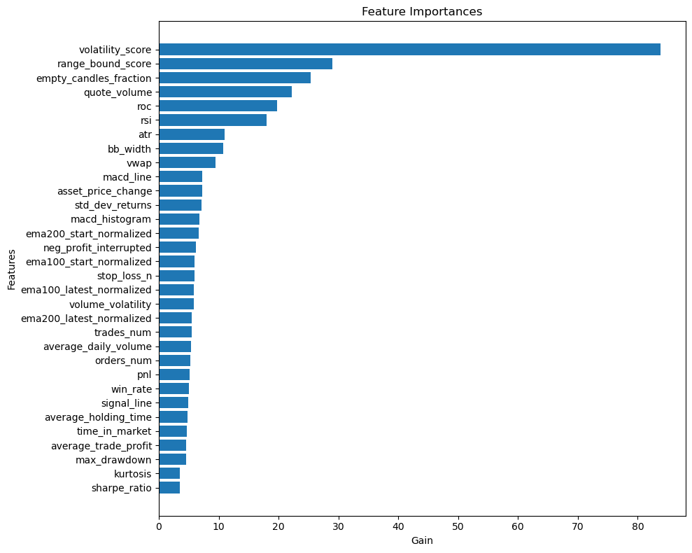

# ML-drive MFI algo trading

Utilities for researching and running a Money Flow Index (MFI) based crypto trading workflow on Binance and MEXC.

This repo is centered around three use cases:

- fetch historical candles for many symbols
- analyze symbols with the MFI strategy and write ranked results
- run the trading loop live or in dry-run mode

The code is script-driven rather than packaged as a library. Most outputs are written under `out/YYYY_MM_DD/...`.

## What Is Here

- `mfi_functions.py`: core MFI logic, candle retrieval helpers, plotting, trading execution helpers
- `mfi_analysis.py`: point-in-time cross-sectional analysis of symbols
- `mfi_get_candles.py`: bulk 1-minute candle downloader
- `mfi_grand_analysis.py`: rolling historical analysis over many timepoints
- `mfi_algo.py`: single-symbol trading run
- `mfi_infinite_trade.py`: repeated analyze-then-trade loop with optional XGBoost filtering
- `exchanges.py`: Binance and MEXC clients, including live order execution
- `data_analysis/`: one-off research and plotting scripts
- `scripts/`: convenience shell wrappers

## Requirements

The repository does not currently include a lockfile or `requirements.txt`, so the environment has to be assembled manually.

Python packages used by the main scripts:

- `numpy`
- `pandas`
- `requests`
- `PyYAML`
- `tqdm`
- `scipy`
- `matplotlib`
- `mplfinance`
- `TA-Lib`
- `python-binance`
- `pymexc`

Additional packages used only by some workflows:

- `xgboost`
- `joblib`
- `plotly`
- `scikit-learn`
- `optuna`
- `cupy`

Optional non-Python tooling:

- `Rscript` for the `.R` analysis scripts in `data_analysis/`
- system TA-Lib libraries if your Python `TA-Lib` wheel is not available for the platform

Example setup:

```bash
python -m venv .venv
source .venv/bin/activate
pip install numpy pandas requests PyYAML tqdm scipy matplotlib mplfinance TA-Lib python-binance pymexc
```

If you plan to use the ML-backed infinite trading loop, also install:

```bash
pip install xgboost joblib scikit-learn
```

## Credentials

Live exchange credentials are loaded from a local `keys.yaml` file in the repo root. The code expects this shape:

```yaml
binance:
  api_key: "YOUR_BINANCE_KEY"
  api_secret: "YOUR_BINANCE_SECRET"

mexc:
  api_key: "YOUR_MEXC_KEY"
  api_secret: "YOUR_MEXC_SECRET"
```

Notes:

- `keys.yaml` is optional for read-only analysis and candle downloads on Binance public endpoints.
- It is required for live order placement.
- Keep it untracked.

## Main Workflows

### 1. Download Historical Candles

Download 1-minute candles for a set of symbols or the full spot universe:

```bash
python mfi_get_candles.py --exchange binance --months_back 6 --threads 4
```

Limit to specific symbols:

```bash
python mfi_get_candles.py --exchange binance --symbols BTCUSDT,ETHUSDT,SOLUSDT --months_back 3 --threads 3
```

Outputs:

- per-symbol CSV files
- `symbols.txt`
- timestamped logs

All under `out/YYYY_MM_DD/get_candles/...`.

### 2. Analyze Symbols at a Point in Time

Run the MFI analysis over a symbol list or the full exchange universe:

```bash
python mfi_analysis.py --exchange binance --threads 8
```

Analyze only selected symbols:

```bash
python mfi_analysis.py --exchange binance --symbols BTCUSDT,ETHUSDT --no_vol_threshold
```

Replay analysis at a historical timestamp in UTC:

```bash
python mfi_analysis.py --exchange binance --now 2024_09_08__14_59 --symbols BTCUSDT,ETHUSDT
```

Useful flags:

- `--plot_all`: generate plots for all analyzed assets instead of just top and bottom subsets
- `--no_vol_threshold`: disable the minimum quote-volume filter
- `--vol_threshold`: override the default volume threshold
- `--threads`: parallel workers for symbol analysis

Outputs go under `out/YYYY_MM_DD/analysis/...` and typically include logs, CSV summaries, and plots.

### 3. Run a Single-Symbol Trading Session

Dry run:

```bash
python mfi_algo.py --exchange binance --symbol BTCUSDT --usdt_amount 100 --dry-run
```

Live mode uses credentials from `keys.yaml`:

```bash
python mfi_algo.py --exchange mexc --symbol BTCUSDT --quantity 0.002
```

Outputs go under `out/YYYY_MM_DD/trading/`.

### 4. Run Rolling Historical Analysis

This script walks backward through time in `MFI_TRADING_TIMEOUT_H` windows and writes per-symbol historical features and trading results:

```bash
python mfi_grand_analysis.py --exchange binance --months_back 6 --threads 4
```

Restrict symbols directly:

```bash
python mfi_grand_analysis.py --exchange binance --symbols BTCUSDT,ETHUSDT
```

Or load them from a file:

```bash
python mfi_grand_analysis.py --exchange binance --symbols_file path/to/symbols.txt
```

Outputs go under `out/YYYY_MM_DD/grand_analysis/...`.

### 5. Run the Infinite Trading Loop

The infinite trader repeatedly:

1. analyzes the market
2. filters candidates
3. optionally scores them with XGBoost
4. runs concurrent trading sessions
5. appends aggregate results to CSV files

Dry-run example:

```bash
python mfi_infinite_trade.py \
  --exchange binance \
  --usdt_amount 100 \
  --dry-run \
  --symbols BTCUSDT,ETHUSDT,SOLUSDT
```

Important: this script expects local ML artifacts that are not part of the repo:

- `ml/2024_09_21_binance_6months_2hours_scaler.pkl`
- `ml/2024_09_21_binance_6months_2hours_xgboost.pkl`
- `ml/2024_09_21_binance_6months_2hours_values.json`

Without those files, `mfi_infinite_trade.py` will fail before trading starts.

## XGBoost Model

The infinite trading loop can optionally filter candidates with an XGBoost multiclass classifier trained on the repo's historical grand-analysis dataset.

Model scope:

- exchange: Binance
- history span: full 6 months
- trading horizon: next 2-hour window
- target classes:
  `0` = next 2-hour PnL is negative
  `1` = next 2-hour PnL is exactly zero
  `2` = next 2-hour PnL is positive

The training script is [data_analysis/2024_09_xgboost_binance.py](/home/anatoly/do/trading/data_analysis/2024_09_xgboost_binance.py). It builds features from the rolling outputs of `mfi_grand_analysis.py`, keeps temporal ordering in the train/test split, and standardizes the inputs before fitting the model.

### Feature Importance



### Evaluation

```text
Classification Report:
              precision    recall  f1-score   support

           0       0.46      0.05      0.09     26985
           1       0.73      0.09      0.16     14197
           2       0.50      0.97      0.66     39675

    accuracy                           0.51     80857
   macro avg       0.56      0.37      0.30     80857
weighted avg       0.53      0.51      0.38     80857
```

This report indicates that the model is much better at identifying the positive-PnL class than the negative or flat classes. That makes it useful as a ranking filter for high-confidence candidates, but not as a balanced classifier across all three outcomes. This is why the model is only used
as a filtering step in the actual trading scripts.

### Features Used

The model uses the following features:

- `pnl`: realized percentage PnL from the strategy over the current analysis window.
- `orders_num`: total number of orders implied by the simulated trading run.
- `trades_num`: number of completed buy/sell trade pairs.
- `stop_loss_n`: number of exits triggered by stop loss.
- `neg_profit_interrupted`: whether the run was stopped early after repeated negative outcomes.
- `asset_price_change`: percentage change of the asset price across the full lookback plus trading window.
- `range_bound_score`: heuristic score for how strongly price reverted toward its mean.
- `volatility_score`: normalized measure of aggregate minute-to-minute price movement.
- `quote_volume`: estimated quote-volume traded over the last 24 hours.
- `win_rate`: percentage of profitable simulated trades.
- `average_trade_profit`: mean profit per completed trade.
- `max_drawdown`: worst peak-to-trough drawdown across cumulative trade profits.
- `sharpe_ratio`: mean trade profit divided by profit volatility.
- `average_holding_time`: average duration of completed trades, in candles.
- `time_in_market`: share of the analyzed period spent in open positions.
- `atr`: latest Average True Range value.
- `rsi`: latest Relative Strength Index value.
- `bb_width`: normalized Bollinger Band width.
- `roc`: latest rate of change, expressed as a percentage.
- `std_dev_returns`: standard deviation of trade-level profits.
- `kurtosis`: kurtosis of trade-level profits.
- `vwap`: volume-weighted average price over the candle set.
- `average_daily_volume`: average recent minute volume aggregated over roughly one day.
- `volume_volatility`: standard deviation of recent candle volumes.
- `macd_line`: latest MACD line value.
- `signal_line`: latest MACD signal line value.
- `macd_histogram`: latest MACD histogram value.
- `empty_candles_fraction`: fraction of recent candles with zero volume.
- `ema100_start_normalized`: normalized EMA100 near the start of the window.
- `ema100_latest_normalized`: normalized EMA100 at the end of the window.
- `ema200_start_normalized`: normalized EMA200 near the start of the window.
- `ema200_latest_normalized`: normalized EMA200 at the end of the window.

## Output Layout

The scripts generally create timestamped directories like:

```text
out/
  2026_03_30/
    analysis/
    get_candles/
    grand_analysis/
    trading/
```

You should expect combinations of:

- `.csv` result files
- `.png` plots
- `.txt` logs
- aggregate trade/result CSVs at the top of `out/`

## Exchange Support

Implemented exchanges:

- Binance
- MEXC

Selection happens via `--exchange binance` or `--exchange mexc`.

The exchange client factory currently hardcodes `keys.yaml` as the credential source.

## Notes And Caveats

- This repo is research-oriented and script-heavy. It does not yet provide a packaged CLI, tests, or dependency pinning.
- The shell scripts in `scripts/` are convenience wrappers, but some appear stale relative to the current Python CLI flags.
- Public-data workflows work without credentials, but any real order execution does not.
- Use `--dry-run` first. The trading scripts call live market order endpoints when not in dry-run mode.
